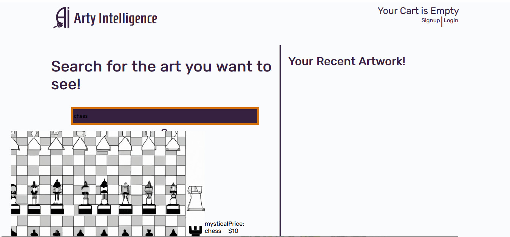

# Arty Intelligence

## Description

E-Commerce AI shop powered with a user-focused MERN stack and React!

## User Story

AS AN user I want to be able to search for AI generatied images. THEN I WANT to add them to my shopping cart. I WANT to be promted to SIGN UP or LOG IN to purchase the images I want to keep. I also WANT to see my recent AI generated images so that I can return and purchase the images at a later date.

### Features

- Full stack application.
- Interactive nav bar.
- Poliused user friendly React powered front-end.
- Login and Sign up functionality.
- Utilises MERN stack.
- React front end.
- Graph ql with a NODE.js and Express.js server.
- Responsive.
- User Dashboard

### Screenshot

### Visit The Deployed Page

[Click Here to Visit the Heroku Page]()

### Visit The GitHub Repo

[Click Here to Visit the Github Repo](https://github.com/ellessed/Ai-commerce)
